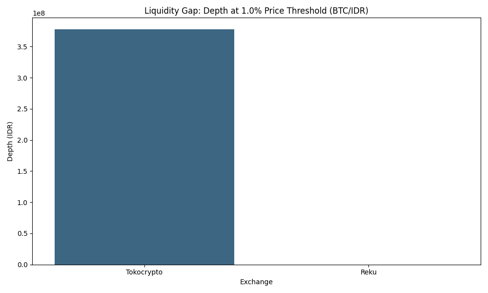

# MM/LP Evaluation Framework: Market Structure & Provider Assessment

**Portfolio Project by Gilang Fajar Wijayanto**  
Senior Treasury & Finance Operations Specialist | CFA Level I | FRM Part I  
[delomite.com](https://delomite.com) | [LinkedIn](https://www.linkedin.com/in/gilang-fajar-6973119a/)

---

## 📋 Overview

This repository features the **MM/LP Evaluation Framework**, a data-driven decision engine designed to evaluate the performance of Market Makers (MM) and Liquidity Providers (LP) in fragmented crypto markets. Grounded in real orderbook data from Indonesian exchanges, it provides a quantitative standard for exchange operators to assess when to move from internal operations to external MM dependencies.

**[Methodology & Detailed Findings →](https://delomite.com/blog/mm-lp-framework/)**

### Business Context
Newly founded exchanges often struggle with a critical strategic gap:
1. **Slippage Risk**: How much volume can the orderbook absorb before a 1% price impact?
2. **Provider Transparency**: Are MMs "gaming" the SLA by thinning books just outside measurement intervals?
3. **Operational Readiness**: At what liquidity threshold should an exchange switch from a retail-only "Mode 1" to an institutional "Mode 3"?

### Key Features
- ✅ **High-Frequency Pipeline**: Captures L2 orderbook snapshots and historical klines across 4 venues (Binance, Tokocrypto, Reku, Indodax).
- ✅ **Liquidity Fingerprinting**: Standardizes metrics including TWAS (Time-Weighted Average Spread), Notional Depth, and Spread Resilience.
- ✅ **Synthetic MM Archetypes**: Models "Good," "Gaming," and "Stressed" MM behaviors to provide an empirical basis for evaluation.
- ✅ **Liquidity Readiness Assessor**: A Python-based decision tool that maps metrics to specific exchange operating modes.
- ✅ **SLA Design Guide**: A turnkey contractual framework for drafting institutional MM agreements in the Indonesian market.

---

## 📊 System Metrics (Empirical Baseline)

| Metric | Tokocrypto (BTC/IDR) | Reku (BTC/IDR) | Global Benchmark |
|--------|----------------------|----------------|------------------|
| **TWAS %** | ~0.000015% | N/A (Sparse) | < 0.25% |
| **Depth @ 1% (USD)** | ~$24,500 | $0 (Zero measurable) | > $750,000 |
| **Quote Presence** | 100% | < 5% | > 99% |
| **Recovery Time** | < 2 min | > 30 min | < 1 min |
| **Status** | **Monitored Trading** | **Not Ready** | **Institutional** |

### Liquidity Gap Analysis

*Figure 1: Numerical depth comparison at the critical 1.0% slippage threshold.*

---

## 🎯 Project Results & Recommendations

Based on the empirical diagnostics conducted between Tokocrypto and Reku, the following operational verdicts have been reached:

- **Tokocrypto BTC/IDR**: Assigned to **Mode 2 (Hybrid)**. While spreads are institutional-grade, the "Tight but Thin" depth (~$24k) requires a primary Market Maker commitment to support institutional-sized takers (> 100M IDR) without excessive slippage.
- **Reku BTC/IDR**: Assigned to **Mode 1 (Growth)**. The sparse quote presence (< 5%) and zero measurable depth at 1% indicate the exchange is currently unsuitable for professional volume and requires a foundational MM engagement to establish basic price continuity.

---

## 🗂️ Project Structure

```
mm-lp-evaluation-framework/
├── data/                          # Raw & processed liquidity data
│   ├── raw/                       # L2 Orderbook snapshots (CSV)
│   └── processed/                 # Refined metric dataframes
│
├── framework/                     # Core evaluation modules
│   ├── metrics.py                 # Standardized TWAS & Depth logic
│   ├── assessor.py                # LiquidityReadinessAssessor engine
│   ├── mm_evaluation_rubric.md    # 6-dimension scoring guide
│   └── sla_design_guide.md        # Contractual terms & penalty tiers
│
├── notebooks/                     # Analytical walkthroughs
│   ├── 02_liquidity_diagnostics.ipynb
│   ├── 04_synthetic_mm_models.ipynb
│   └── 05_decision_threshold_model.ipynb
│
├── assets/                        # Visual proof of work
│   └── charts/                    # Liquidity gap & radar plots
│
├── Makefile                       # Python environment & pipeline manager
└── README.md                      # This file
```

---

## 🚀 Getting Started

### 1. Installation
```bash
git clone https://github.com/alfajr666/mm-lp-evaluation-sample.git
cd mm-lp-evaluation-sample
make setup
```

### 2. Initializing Data Collection
```bash
# Poll orderbooks every 60s for all configured pairs
make collect-live
```

### 3. Run Assessment Widget
Open `notebooks/05_decision_threshold_model.ipynb` to interact with the **Liquidity Readiness Assessor** and derive mode recommendations for any set of input metrics.

---

## 📈 Business Logic & Market Context

This framework addresses the specific constraints of the **Indonesian Market Structure**:
- **Fragmented Liquidity**: Models the "Tight but Thin" phenomenon where local spreads are competitive but depth is retail-concentrated.
- **IDR Denomination**: Includes logic for tracking implied cross-rates against Binance BTC/USDT benchmarks.
- **MM/SLA Tiers**: Maps performance to tiered financial penalties based on Indonesian OJK regulatory expectations for capital market resilience.

---

## 🎯 Use Cases
- **Exchange BD Teams**: Evaluating MM candidates during the RFP/engagement process.
- **Treasury Officers**: Sizing organic inventory requirements and internal buffer spreads.
- **Risk Analysts**: Monitoring real-time tracking error and NBBO participation.
- **Hiring Managers**: Proof of competence in market microstructure, data engineering, and operational risk.

---

## 🤝 Contact
**Gilang Fajar Wijayanto**  
Senior Treasury & Finance Operations Specialist  
📧 gilang.f@delomite.com  
🌐 [delomite.com](https://delomite.com)  
💼 [LinkedIn](https://www.linkedin.com/in/gilang-fajar-6973119a/)

**Certifications:**
- CFA Level I
- FRM Part I
- WMI & WPPE (OJK Indonesia)

---

**Built with:** Python, Pandas, Matplotlib, Seaborn, IPyWidgets  
**Designed for:** Exchange Operations, Market Structure, Liquidity Provision
